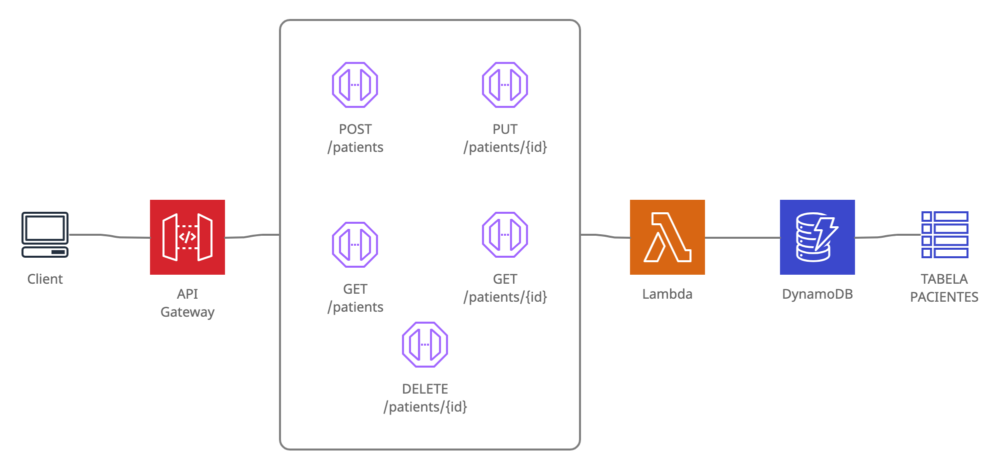

# Alura Med - API

Backend da aplicação para cadastro de pacientes.



## Instalação

Instalação das dependências.

```bash
npm install
```

Inicialização do DynamoDB para rodar localmente.

```bash
sls dynamodb install
```

## Uso

Rodando a aplicação localmente

```bash
sls offline start
```

## Endpoints

```
GET /pacientes

GET /pacientes/{id}

POST /pacientes

PUT /pacientes/{id}

DELETE /pacientes/{id}
```

## Comandos

Adicionando um usuário no cognito

```bash
aws cognito-idp sign-up \
  --region <REGIAO> \
  --client-id <CLIENT_ID> \
  --username user@example.com \
  --password Passw0rd! \
  --user-attributes Name="name",Value="Satoshi"
```

Confirmando o cadastro

```bash
aws cognito-idp admin-confirm-sign-up \
  --region <REGIAO> \
  --user-pool-id <USER POOL ID> \
  --username admin@example.com
```


Generated by [makeareadme](https://www.makeareadme.com/) 
